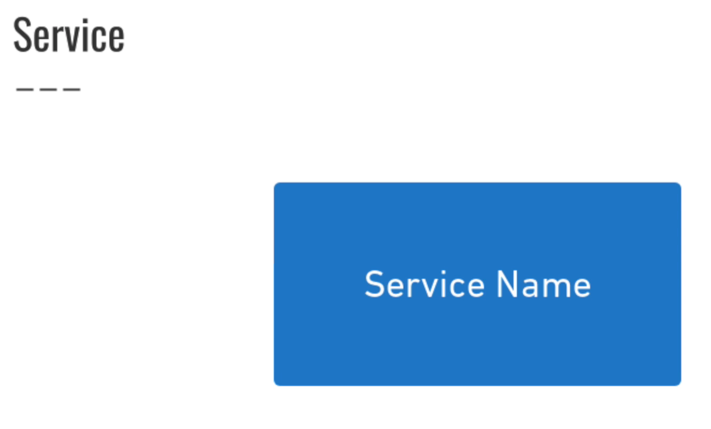
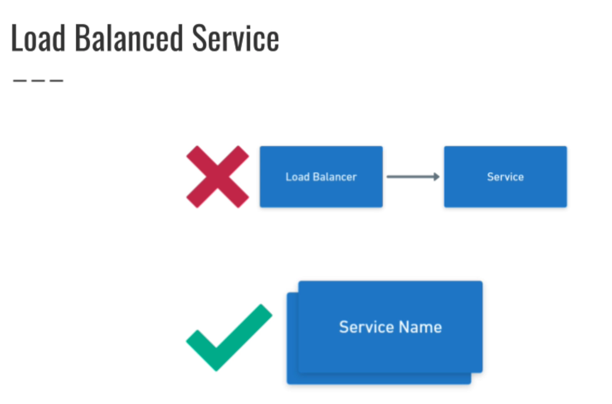
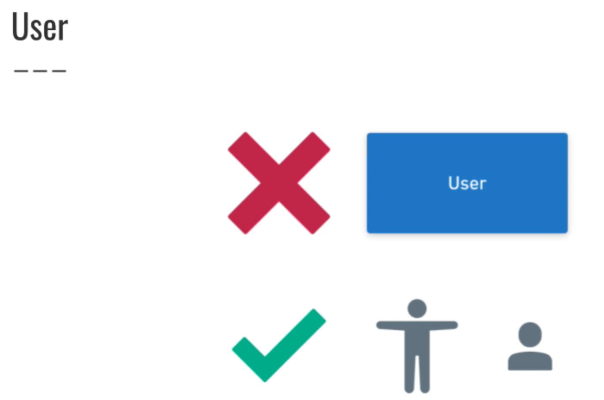
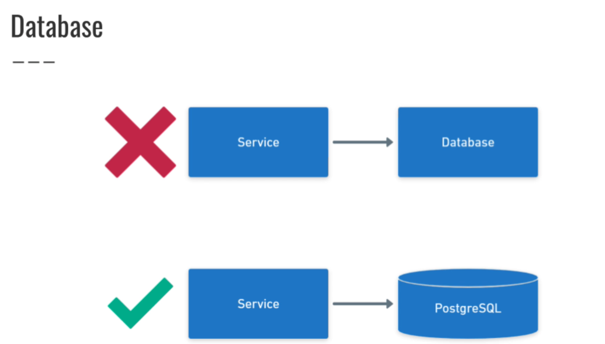
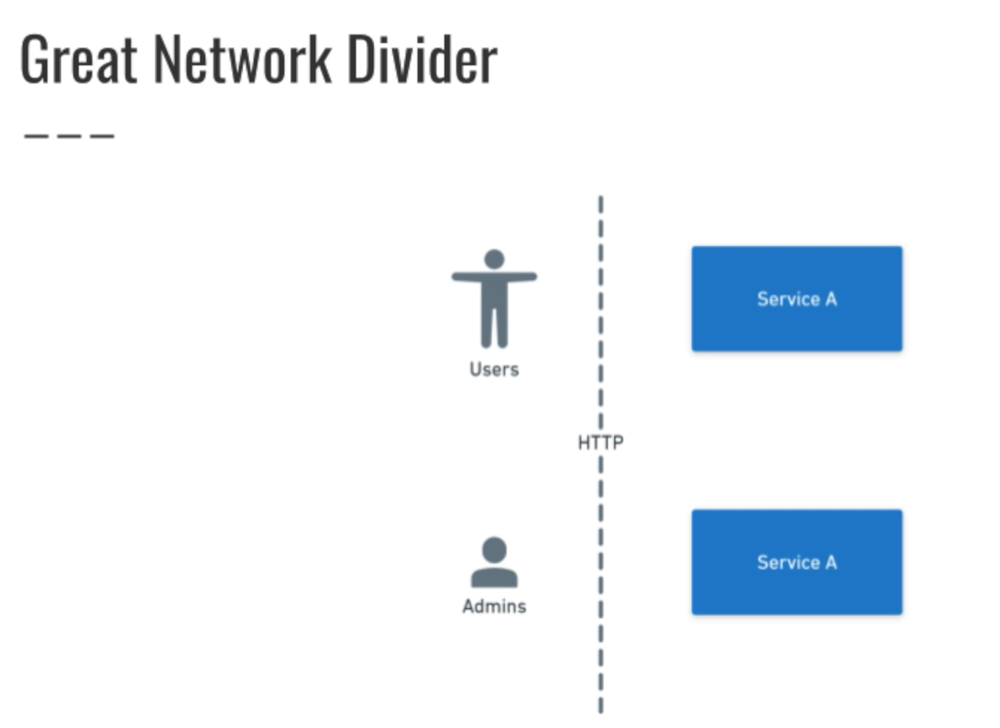
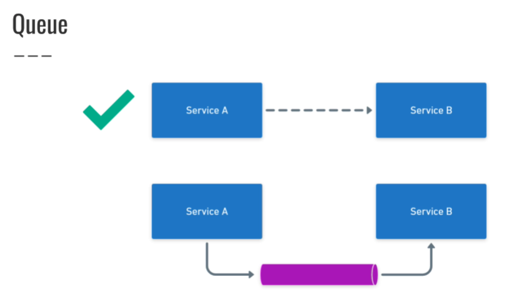
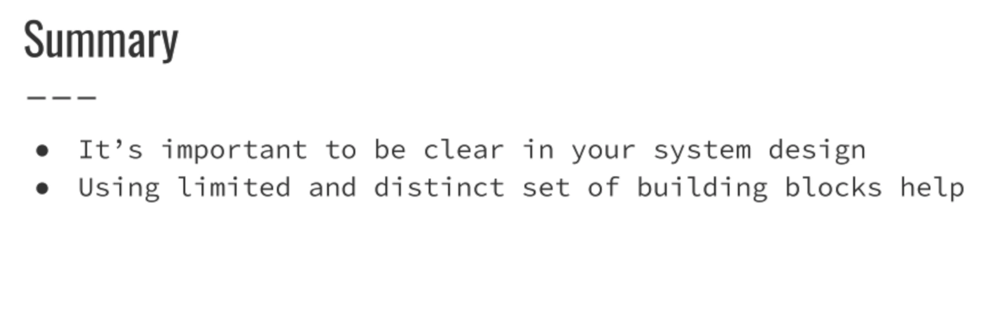
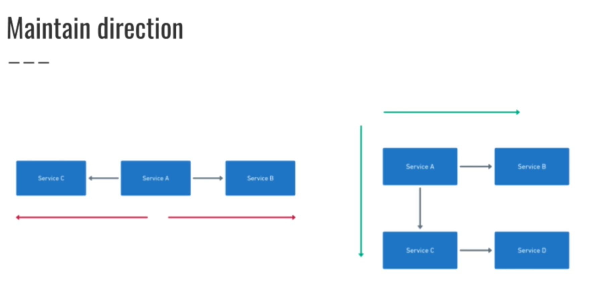
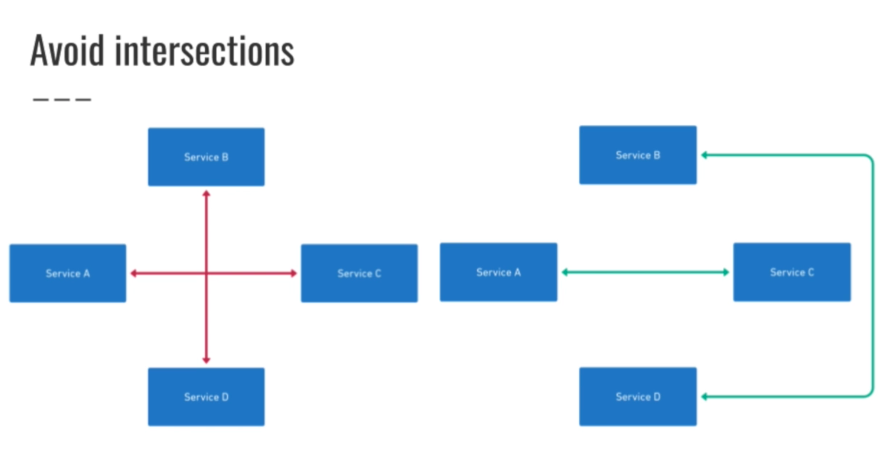
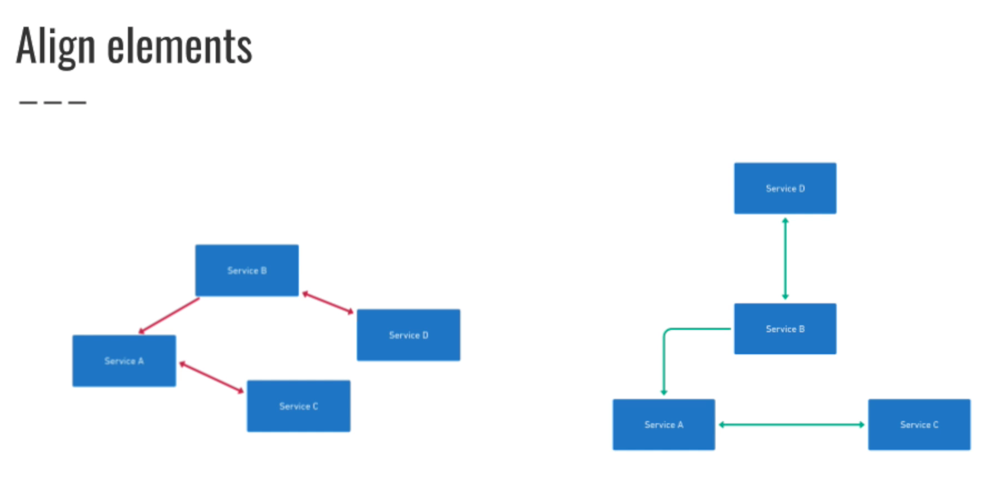

##Info and Docs

## Representing - Service in system-design

## Representing - Load balanced service in system-design

## Representing - User in system-design

## Representing - Database in system-design

## Representing - Network Divider in system-design

## Representing - Queues in system-design

## Summary

## Tips on Diagram flow

## Making Estimates
[interactive_latency](https://colin-scott.github.io/personal_website/research/interactive_latency.html)

#### Estimating Throuput

#### Estimating capacity

