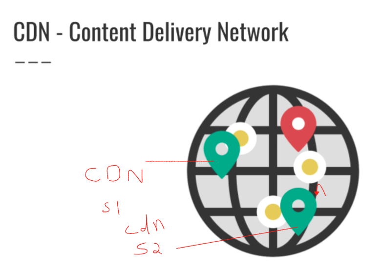
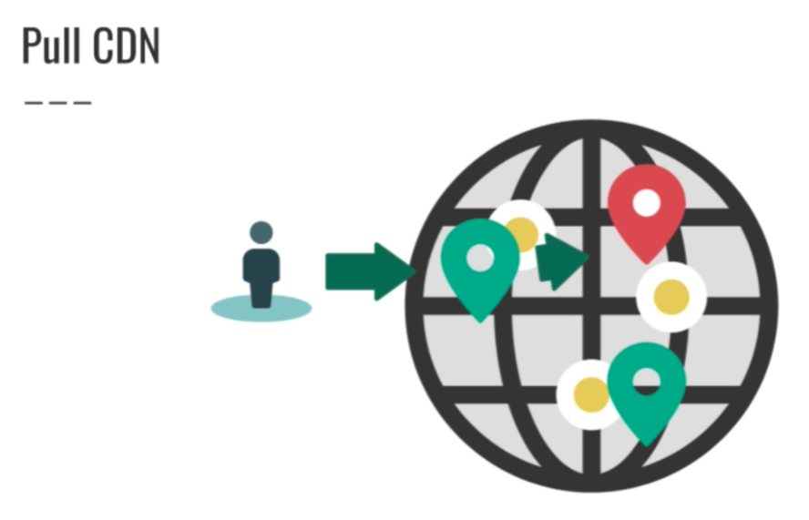

##Info and Docs
[What is a CDN? | How do CDNs work?](https://www.cloudflare.com/en-in/learning/cdn/what-is-a-cdn/)

[What is A distributed denial-of-service (DDoS) attack?](https://www.cloudflare.com/en-in/learning/ddos/what-is-a-ddos-attack/)
## CDN
A content delivery network (CDN) refers to a geographically distributed group of servers which work together to provide fast delivery of Internet content.

A CDN allows for the quick transfer of assets needed for loading Internet content including HTML pages, javascript files, stylesheets, images, and videos. The popularity of CDN services continues to grow, and today the majority of web traffic is served through CDNs, including traffic from major sites like Facebook, Netflix, and Amazon.

A properly configured CDN may also help protect websites against some common malicious attacks, such as Distributed Denial of Service (DDOS) attacks.

#### CDN Example

#### Static Content that will be cached in CDN server
- Images
- CSS
- HTML
- Javascript

#### Types of CDN
- **Push** -> When we upload static content on one server, that will be pushed to all other CDN servers. This approach is good when we have less content.

- **Pull** 
  This is a lazy approach. When user uploads static content in website, if its not available in CDN server, it will download from the actual server and stores it in CDN server.

## Summary
- CDNs allow placing your static assets close to the users
- Reduces the cost because we don't need to have redundant servers across the globe that will be handled by CDN servers(3rd party)
- Decrease latency
- Increases complexity of your system