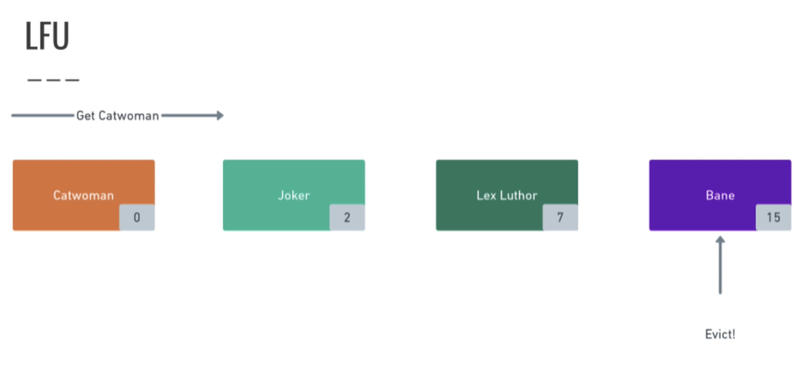

## Info and Docs
[Cache (computing) - wiki](https://en.wikipedia.org/wiki/Cache_(computing))

[AWS - what is caching](https://aws.amazon.com/caching/)

[Caching strategies](https://docs.aws.amazon.com/AmazonElastiCache/latest/mem-ug/Strategies.html)

[Cache replacement policies](https://en.wikipedia.org/wiki/Cache_replacement_policies)

[All things caching- use cases, benefits, strategies, choosing a caching technology, exploring some popular products](https://medium.datadriveninvestor.com/all-things-caching-use-cases-benefits-strategies-choosing-a-caching-technology-exploring-fa6c1f2e93aa)

## Caching Strategies
#### Cache Aside Caching Strategy

####Read Through Caching Strategy
This pattern is common in ORM frameworks like Hibernate

#### Write Through Caching Strategy

Main disadvantage is redundance means this caches the data which might not be read ever.

#### Write Behind Caching Strategy

Here cache acts as a buffer. 

## Cache Eviction Policies
#### Most commonly used strategies
- LRU - Least Recently Used
- LFU - Most frequently Used

There are many other eviction policies. 

#### LRU
- LRU is like a linked list. Newly accessed one will be added at the tail and head will be evicted

-----

Accessed Joker here, so it moved to tail
-----

#### LFU
- Here for every cached item, one counter will be maintained. 
- Everytime u access a item in the cache, counter will reset to 0
- While cached item not accessed, its counter will be keep on increasing. Larger counter value one will be eligible for eviction

#### Summary of LRU & LFU.png

## Redis

-----

----

-----

-----

