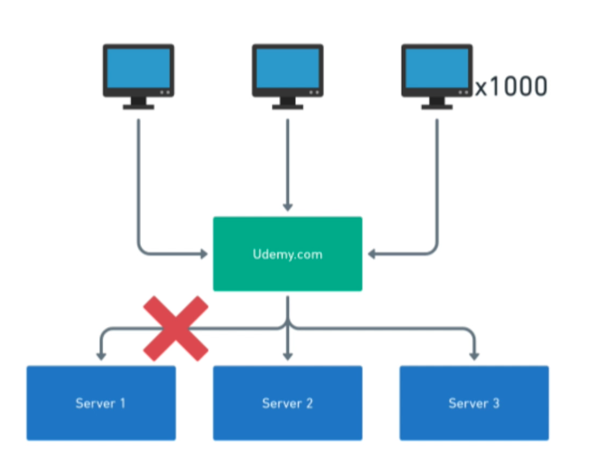

##Info and Docs

## Load Balance
- Load balancer is a machine that runs a reverse proxy software like apache
- Usually , there will be muliple machines for loadbalancer. If one goes down, other active one will be used
- Goal of the software is to distribute the requests between multiple servers that hosts the actual application

#### Task - Design Udemy.com which handles heavy traffic

#### Load balancing Strategies
- Round Robin
- Least Connections
- Resource based
- Weighted variants of the above
- Random

## Types of Load Balancers
#### Layer 4
- Transport Layer
- Has access to: TCP or UDP, IP, Port

#### Layer 7
- Application Layer
- Has access to everything layer4 has
- In addition,  has access to HTTP headers, cookies, payload

[What Is Layer 4 Load Balancing?](https://www.nginx.com/resources/glossary/layer-4-load-balancing/)
#### Load balancer examples
- NGiNX
- HAPROXy
- Traefik

#### Load balancer advantages
- Resilience

 

- Scalability.. Horizontal scaling

 
 
 
 ## Summary
 - Load balancer is a machine that acts as a reverse proxy
 - For each user request, it picks one of the backend servers based on its strategy
 - Most common strategy is Round Robin, but there are others
 - Load balancers make our system more scalable and resilent
 