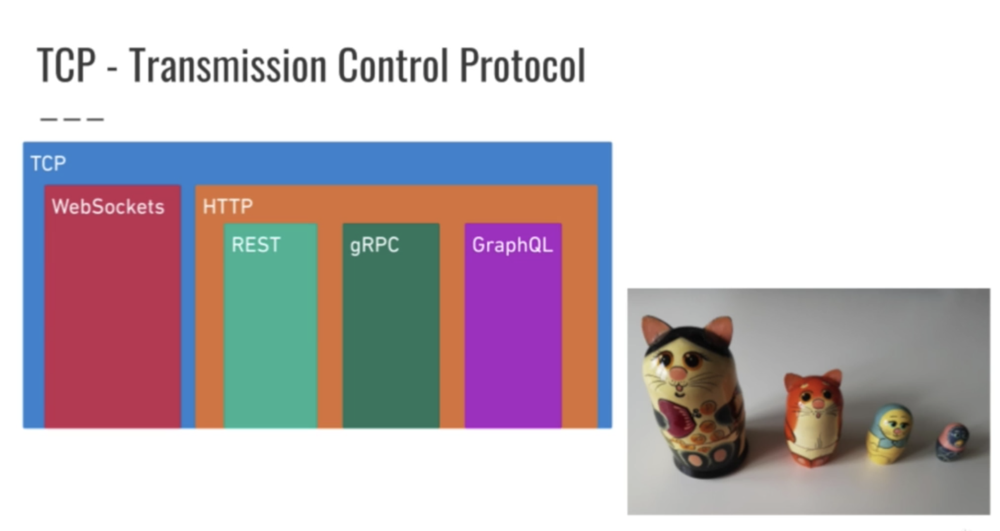
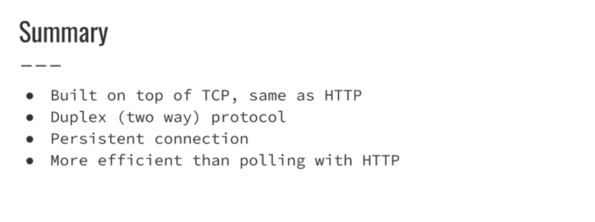
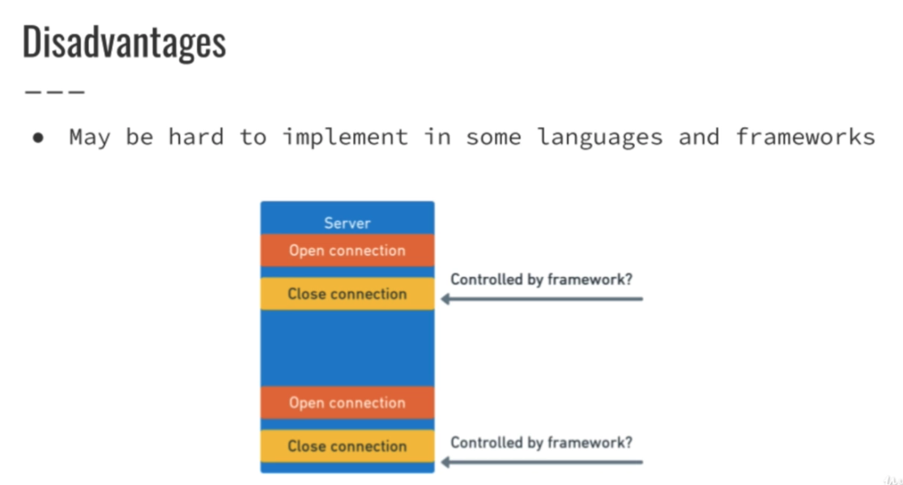

## Info & Docs
[The Evolution of HTTP – HTTP/2 Deep Dive](https://ably.com/topic/http2)

[Long Polling Implementation With Java and Spring Boot](https://www.bemyaficionado.com/long-polling-with-java-and-spring-boot/)

[When to use a HTTP call instead of a WebSocket (or HTTP 2.0)](https://blogs.windows.com/windowsdeveloper/2016/03/14/when-to-use-a-http-call-instead-of-a-websocket-or-http-2-0/)

[Does HTTP/2 make websockets obsolete?](https://stackoverflow.com/questions/28582935/does-http-2-make-websockets-obsolete)

[WebSockets vs Long Polling](https://ably.com/blog/websockets-vs-long-polling)

## TCP

## UDP

## TCP vs UDP

## HTTP

## REST

## Web Sockets

----

----

----

## Long polling

----

----

## HTTP/2

## RPC

##gRPC

## GraphQL

