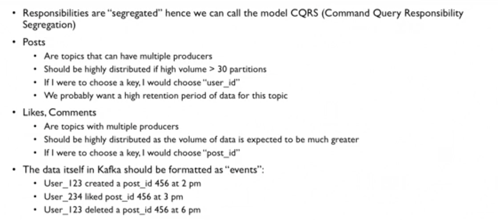
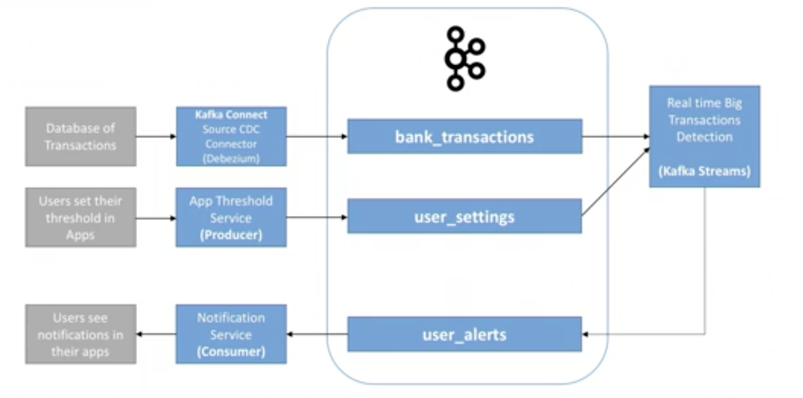

## Info and Docs
[Apache Kafka Essential Training by Kumaran Ponnambalam](https://www.linkedin.com/learning/apache-kafka-essential-training-getting-started/getting-started-with-apache-kafka?u=42751868)

[Kafka Clients](https://docs.confluent.io/platform/current/clients/index.html)

[learn-apache-kafka-for-beginners by Stephane Maarek](https://www.linkedin.com/learning/learn-apache-kafka-for-beginners/apache-kafka-in-five-minutes?u=42751868)

[Kafka Documentation](https://kafka.apache.org/documentation/)

[kafka-beginners-course by Stephane Maarek](https://github.com/simplesteph/kafka-beginners-course)

## Before Kafka / Problems Without Kafka
#### Problems Without Kafka


----


----

#### Why Apache Kafka? 


----


----


-----

#### Apache Kafka Use Cases


----

#### Apache Kafka Examples


## Topics , Partitions and Offsets


## Topics Example: truck_gps


## Topics , Partitions and Offsets Summary


## Brokers


## Brokers and Topics


## Topic Replication Factor


----


## Concept Of Leader For A Partition


## Producers


----


----


## Consumers


----


----


## Consumer Offsets


#### Delivery Semantics for Consumers


## Kafka Broker Discovery


## Zookeeper


## Kafka Guarantees


## Kafka Theory Summary


## Kafka Setup
####MacOS
[Kafka Downloads](https://kafka.apache.org/downloads) --> For binary download
Set this your PATH. 

```shell script
$ brew install kafka

$ kafka-topics 
   Run this command to verify whether installation is successful

$ cd /Users/annappar/OraDocs/AconexMac/Softwares/kafka_2.13-2.8.0
  Kafka binary is here. We will use few configs from this location

$ zookeeper-server-start ./config/zookeeper.properties

$ cat ./config/zookeeper.properties | grep data
  > dataDir=/Users/annappar/OraDocs/AconexMac/Softwares/kafka_2.13-2.8.0/data/zookeeper

$ cat ./config/server.properties| grep "log.dirs"
  > log.dirs=/Users/annappar/OraDocs/AconexMac/Softwares/kafka_2.13-2.8.0/data/kafka

$ kafka-server-start config/server.properties
```

## Kafka CLI
#### Kafka topics CLI
```shell script
$ kafka-topics --zookeeper 127.0.0.1:2181 --topic first_topic --create
 > This will fail -> Missing required argument "[partitions]"

$ kafka-topics --zookeeper 127.0.0.1:2181 --topic first_topic --create --partitions 3
  > This will fail again > Missing required argument "[replication-factor]"

$ kafka-topics --zookeeper 127.0.0.1:2181 --topic first_topic --create --partitions 3 --replication-factor 2
  > This will fail again
  > Error while executing topic command : Replication factor: 2 larger than available brokers: 1
  > We can nt give replica count less than the number of available brokers

$ kafka-topics --zookeeper 127.0.0.1:2181 --topic first_topic --create --partitions 3 --replication-factor 1
  > This will be successful

$ kafka-topics --zookeeper 127.0.0.1:2181 --list

$ kafka-topics --zookeeper 127.0.0.1:2181 --topic first_topic --describe

$ kafka-topics --zookeeper 127.0.0.1:2181 --topic second_topic --create --partitions 3 --replication-factor 1

$ kafka-topics --zookeeper 127.0.0.1:2181 --topic second_topic --delete

$ kafka-topics --zookeeper 127.0.0.1:2181 --list
```

#### Kafka console producer CLI
````shell script
$ kafka-console-producer --broker-list 127.0.0.1:9092 --topic first_topic
  >hello Annappa
  >awesome course!
  >learning kafka
  >just another message :)
 press ctrl+c to end producing messages

$ kafka-console-producer --broker-list 127.0.0.1:9092 --topic first_topic --producer-property acks=all

$ kafka-console-producer --broker-list 127.0.0.1:9092 --topic new_topic  
  > This will create the new topic as new_topic does not exist

$ kafka-topics --zookeeper 127.0.0.1:2181 --list

$ kafka-topics --zookeeper 127.0.0.1:2181 --topic new_topic --describe

$ cat ./config/server.properties| grep "num.partitions"
  num.partitions=1
  > This means, by default , when topic is created, only one partition will be created

$ vi ./config/server.properties 
  > change the default partitions value from 1 to 3. Stop kafka server and start it,

$ kafka-server-start config/server.properties

$ kafka-console-producer --broker-list 127.0.0.1:9092 --topic new_topic_2

$ kafka-topics --zookeeper 127.0.0.1:2181 --list

$ kafka-topics --zookeeper 127.0.0.1:2181 --topic new_topic_2 --describe
````

#### Kafka console consumer CLI
```shell script
$ kafka-console-consumer --bootstrap-server 127.0.0.1:9092 --topic first_topic
  > This will read only the new messages. 
  > U can test it by running the producer and producing few messages to the topic

$ kafka-console-consumer --bootstrap-server 127.0.0.1:9092 --topic first_topic --from-beginning
  > This will read the messages from the beginning
```

#### #### Kafka console consumer group CLI
Start two consumers with the same group and one producer to the topic - **first_topic**
```shell script
$ kafka-console-consumer --bootstrap-server 127.0.0.1:9092 --topic first_topic --group my-first-application

$ kafka-console-consumer --bootstrap-server 127.0.0.1:9092 --topic first_topic --group my-first-application

$ kafka-console-producer --broker-list 127.0.0.1:9092 --topic first_topic

Here 2 consumers are there to read it from 2 partitions.
```

Start 3 consumers with the same group and one producer to the topic - **first_topic**

```shell script
$ kafka-console-consumer --bootstrap-server 127.0.0.1:9092 --topic first_topic --group my-first-application

$ kafka-console-consumer --bootstrap-server 127.0.0.1:9092 --topic first_topic --group my-first-application

$ kafka-console-consumer --bootstrap-server 127.0.0.1:9092 --topic first_topic --group my-first-application

$ kafka-console-producer --broker-list 127.0.0.1:9092 --topic first_topic

Here 3 consumers are there to read it from 3 partitions. Load will be equally distributed
```

If you stop one consumer out of 3, load will be rebalanced between 2 consumers ..

Now stop all consumers. and start the below one with bew group

```shell script
$ kafka-console-consumer --bootstrap-server 127.0.0.1:9092 --topic first_topic --group my-second-application --from-beginning
  > This will read all the messages from the beginning and sets the offset
```

Now stop the above consumer and re-run again.
```shell script
$ kafka-console-consumer --bootstrap-server 127.0.0.1:9092 --topic first_topic --group my-second-application --from-beginning
  No old messages read as all the messages were read by this group in the previous run. But it can read the newly arriving messages
```

## kafka-consumer-groups
```shell script
$ kafka-consumer-groups --bootstrap-server localhost:9092 --list

$ kafka-consumer-groups --bootstrap-server localhost:9092 --describe --group my-second-application
```

## Resetting offset

## Kafka Java Programming
[ProducerDemo.java](./src/main/java/com/kscm/kafka/ProducerDemo.java)

[ProducerDemoWithCallback.java](./src/main/java/com/kscm/kafka/ProducerDemoWithCallback.java)

[ProducerDemoKeys.java](./src/main/java/com/kscm/kafka/ProducerDemoKeys.java)

[ConsumerDemo.java](./src/main/java/com/kscm/kafka/ConsumerDemo.java)

##### Run the below ConsumerDemoGroups.java multiple times(multiple consumers in a group) and start a producer and observe how rebalancing happens
[ConsumerDemoGroups.java](./src/main/java/com/kscm/kafka/ConsumerDemoGroups.java)

[ConsumerDemoAssignSeek](./src/main/java/com/kscm/kafka/tutorial1/ConsumerDemoAssignSeek.java)

## Twitter Producer Example

[TwitterProducer](./src/main/java/com/kscm/kafka/tutorial2/TwitterProducer.java)

## Producers Acks Deep Dive 
#### acks=0 (no acks) 


#### acks=1 (Leader acks)


#### acks=all (replicas acks)


----


----


## Retries by producer

## Idempotent Producer

## Delivery semantics for consumers

## Consumer - Idempotence

## Consumer - Poll Behaviour

## Consumer Offset Commis Strategy

## Kafka Connect

## Kafka Streams for filtering data

## Kafka Schema registry for data /message verification/validation 

## Kafka Partition count intuition / Guidelines

## Replication Factor intuition / Guidelines

## Cluster Guidelines

## Case Studies
#### MovieFlex Architecture using Kafka


----


----


#### GetTaxi 


----


----


#### CQRS(Command Query Responsibility Segregation) - MySocialMedia


----


----


#### Finance Application MyBank


----


----


## Big Data Ingestion

## Logging and Monitoring Using Kafka


## Authentication in Kafka

## Encryption in Kafka

## Authorization in kafka