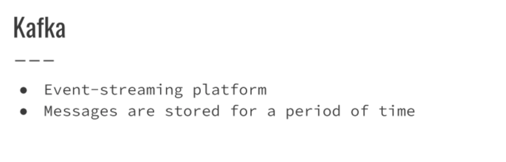

##Info and Docs
[Comparing Publish-Subscribe Messaging and Message Queuing](https://dzone.com/articles/comparing-publish-subscribe-messaging-and-message)

[Visualizing Kafka](https://timothystepro.medium.com/visualizing-kafka-20bc384803e7)

[Kafka in a Nutshell](https://sookocheff.com/post/kafka/kafka-in-a-nutshell/)

[How to choose the number of topics/partitions in a Kafka cluster?](https://www.confluent.io/blog/how-choose-number-topics-partitions-kafka-cluster/)

[A Practical Introduction to Kafka Storage Internals](https://medium.com/@durgaswaroop/a-practical-introduction-to-kafka-storage-internals-d5b544f6925f)

[RabbitMQ for beginners - What is RabbitMQ?](https://www.cloudamqp.com/blog/part1-rabbitmq-for-beginners-what-is-rabbitmq.html)

[What is the relationship between connections and channels in RabbitMQ?](https://www.cloudamqp.com/blog/the-relationship-between-connections-and-channels-in-rabbitmq.html)

[AMQP 0-9-1 Model Explained](https://www.rabbitmq.com/tutorials/amqp-concepts.html)

[Advanced Message Queuing Protocol](https://en.wikipedia.org/wiki/Advanced_Message_Queuing_Protocol)

## Notes
#### Example Problem for use of Queueing- Pizza Service

----

#### Rescue for Pizza service - Queue

#### Producers & Consumers

#### Disadvantages of using Queues
Increases the complexity of the system as there is no confirmation back to producer

#### Queue Examples

#### Queues Overviews

#### Pub-Sub Queueing Type

#### Message Queing Type.png

#### Message Queueing vs Pb-Sub Model

## RabbitMQ

## Apache Kafka

#### Topic

#### Kafka - Events/Message

#### Kafka Partitions

#### Kafka - Partitions Overview

#### Kafka - Consumer Groups

#### Kafka - Summary

